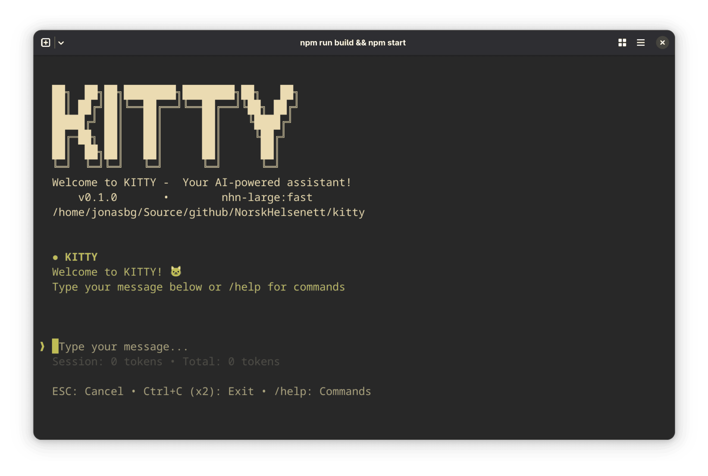

<div align="center">

# KITTY

**Your AI-powered terminal assistant**

**KI** in **TTY** – *KI* being the Norwegian word for AI, *TTY* being the terminal.

A terminal-first AI chat client with agent and plugin support, rendered with Ink for a polished TUI experience.



</div>

## Table of Contents

- [Features](#features)
- [Quick Chat Snapshot](#quick-chat-snapshot)
- [How to Install](#how-to-install)
- [How to Use](#how-to-use)
  - [Interactive TUI](#interactive-tui)
  - [Interactive with Debug Details](#interactive-with-debug-details)
  - [Non-interactive (pipe or direct query)](#non-interactive-pipe-or-direct-query)
  - [Slash Commands](#slash-commands)
  - [Plugin and Agent CLIs](#plugin-and-agent-clis)
- [Project Context](#project-context)
- [Development Scripts](#development-scripts)
- [Contributing](#contributing)
- [License](#license)

## Features

- **Clean Chat Interface** – Intuitive terminal-based chat that hides system/tool chatter for a cleaner conversation view.
- **Intelligent Agent Engine** – Orchestrator that analyzes requests, creates task plans, and executes them with optional confirmation prompts.
- **Reasoning & Thinking** – Extended thinking support with visible planning, reflection, and decision-making steps for complex tasks.
- **Plugin System** – Extensible plugin manager (`kitty plugin ...`) for custom tools and integrations.
- **Agent Management** – Built-in agent manager (`kitty agent ...`) to create, manage, and run custom agents.
- **Task Tracking** – Live task list, animated status bar, and token counter to monitor tool execution in real-time.
- **Project Context** – Automatically generates and maintains `KITTY.md` project documentation for persistent, context-aware conversations.
- **Flexible I/O** – Works interactively in the TUI, via piped input, or as a one-off CLI query.
- **Rich Terminal UI** – Built with Ink for a polished, responsive terminal experience with markdown rendering and syntax highlighting.
- **Model Switching** – Switch between different AI models on the fly without restarting the conversation.

## Quick Chat Snapshot

- **You** – Ask a question, run a slash command (`/help`, `/model`, `/init`), or paste context directly in the chat.
- **KITTY** – Streams markdown-formatted answers with syntax highlighting and proper formatting.
- **Thinking** – Shows planning, reflection, and decision-making steps when the agent is reasoning through complex tasks.
- **Tasks** – Tool execution appears as real-time tasks; expanded tool logs are visible in `--debug` mode for detailed inspection.
- **Status** – Live token counter shows session and total token usage; ESC cancels requests, Ctrl+C (twice) exits.
- **Logs** – In debug mode, Kitty writes detailed JSON traces to `kitty-debug-<timestamp>.log` for troubleshooting.

## How to Install

Make sure you have Node.js and npm installed.

**Step 1: Clone the repository and install dependencies**

```bash
git clone https://github.com/NorskHelsenett/kitty.git
cd kitty
npm install
npm run build
```

**Step 2 (Optional): Install globally**

To make `kitty` available on your PATH, you have two options:

**Option A: Install from npm registry**

```bash
npm install -g norskhelsenett-kitty
```

**Option B: Install from source** (for development)

```bash
npm install -g .
```

Then you can run `kitty` from anywhere:

```bash
kitty "What does this code do?"
```

## How to Use

### Interactive TUI

```bash
npm run dev
```

### Interactive with Debug Details

```bash
npm run dev -- --debug
```

Debug mode keeps the chat transcript intact but adds tool/thinking messages and writes a JSON debug log in the current directory. Launch without `--debug` when you want a concise chat view.

### Non-interactive (pipe or direct query)

```bash
kitty "summarize this diff" < diff.txt
echo "hello" | kitty "translate to Norwegian"
```

### Slash Commands

Inside the TUI, you can use these commands:

| Command | Description |
|---------|-------------|
| `/help` | Show available commands and keyboard shortcuts |
| `/model` | Switch the active AI model |
| `/agents` | Manage and run custom agents |
| `/plugins` | Enable or disable installed plugins |
| `/init` | Generate `KITTY.md` project context (auto-run on first use) |
| `/reinit` | Regenerate `KITTY.md` from scratch, overwriting the existing file |
| `/clear` | Clear the visible conversation history |

**Keyboard Shortcuts**

| Key | Action |
|-----|--------|
| `ESC` | Cancel ongoing AI request |
| `Ctrl+C` (×2) | Exit the application |

### Plugin and Agent CLIs

```bash
kitty plugin list
kitty plugin install https://example.com/my-plugin.json
kitty agent install examples/agent-demo.yaml
kitty agent run my-agent --input prompt.txt
```

## Project Context

Kitty can automatically generate and maintain a `KITTY.md` file that captures your project's structure, build commands, dependencies, and coding conventions. This file is loaded on every startup, giving the AI deep context about your project.

**How it works:**

1. Run `/init` inside the TUI (or it runs automatically on first launch)
2. Kitty scans your project directory and generates `KITTY.md`
3. On every new chat, the agent loads this context for richer, more accurate answers
4. Update anytime with `/reinit` to refresh the project snapshot

This is especially useful for:
- Understanding project structure without having to explain it each time
- Providing accurate code suggestions based on your actual patterns
- Running tools with proper context about your build system
- Maintaining consistency across long multi-session conversations

## Development Scripts

| Command | Description |
|---------|-------------|
| `npm run dev` | Run the interactive TUI |
| `npm run dev -- --debug` | Run TUI with debug logging and thinking messages |
| `npm run build` | Compile TypeScript to JavaScript |
| `npm start` | Start the built CLI |
| `npm test` | Run test suite |
| `bash scripts/build-release.sh` | Create a release bundle |

See `package.json` for the complete list, including version bump and additional scripts.

## Contributing

Issues and pull requests are welcome. We encourage community contributions to improve Kitty!

When reporting issues:
- Include reproduction steps
- Note whether you ran Kitty in standard or debug mode
- Share any relevant logs from `--debug` mode if applicable

## License

This project is licensed under the **MIT License** – a permissive open-source license that allows you to:

- Use Kitty freely in personal and commercial projects
- Modify and distribute the software
- Include it in proprietary applications

See [LICENSE](./LICENSE) for the full license text.

**Attribution appreciated but not required.** We're happy to have you use and build upon Kitty!
